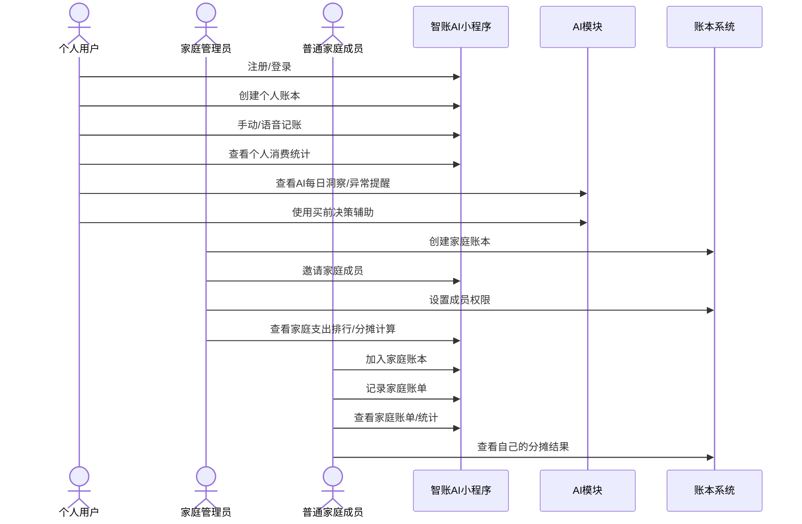
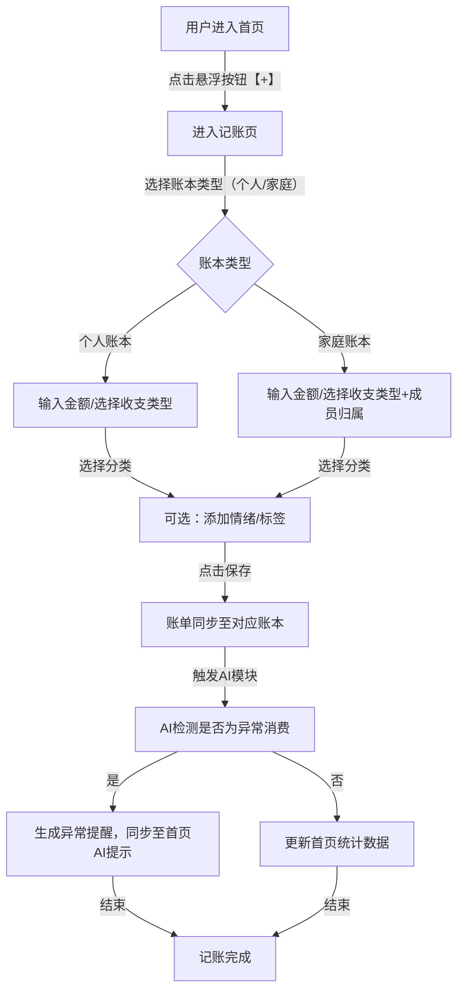
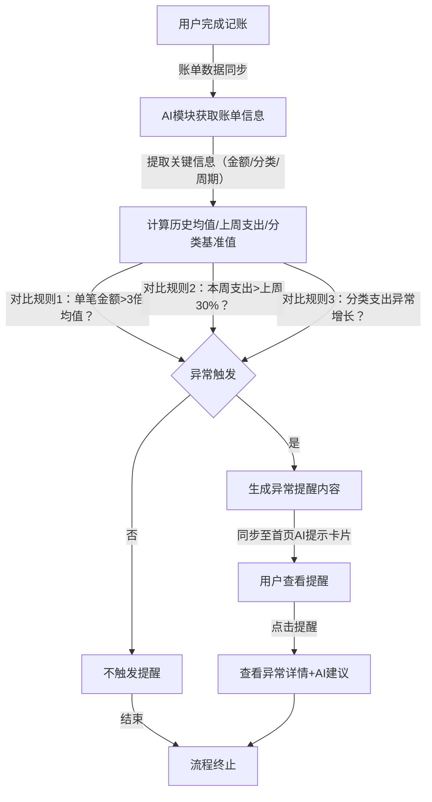
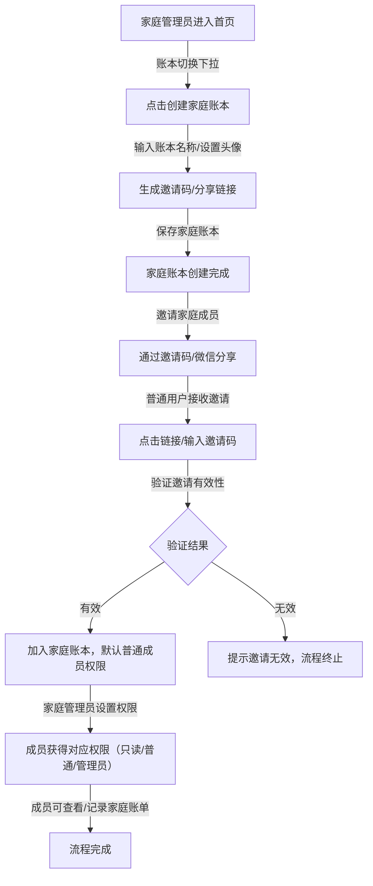

# 智账AI产品需求文档（PRD V1.0）

# 一、产品基本信息

**产品名称（暂定）**：好记账

**产品类型**：微信小程序

**产品阶段**：V1.0 MVP

**产品定位**：支持个人账本与家庭账本协作的 AI 记账工具

**核心差异点**：

1. 情绪 + 消费关联分析

2. AI消费洞察与预测

3. 家庭协同记账 + 权限管理

4. 决策辅助功能（买前评估）

# 二、产品目标

## 2.1 产品目标

1. 提供高效记账体验（3秒完成记账）

2. 支持家庭协作记账

3. 用AI提高用户粘性

4. 提升长期留存

## 2.2 核心指标（KPI）

|指标|目标|
|---|---|
|次日留存|≥40%|
|7日留存|≥25%|
|日均记账次数|≥2|
|AI报告打开率|≥50%|
|家庭账本创建率|≥20%|
# 三、用户角色定义

## 3.1 用户类型

### 1️⃣ 个人用户

- 独立使用

- 管理个人账本

### 2️⃣ 家庭成员

- 加入家庭账本

- 可记录共同账单

- 权限可控

### 3️⃣ 家庭管理员

- 创建家庭账本

- 邀请成员

- 设置权限

# 四、产品功能结构

```plain text
首页
├── 今日概览
├── 快速记账
├── 本月统计
├── AI提示

账本切换
├── 个人账本
├── 家庭账本（可多个）

记账页
├── 金额
├── 分类
├── 情绪
├── 标签
├── 成员归属

AI分析页
├── 消费趋势
├── 情绪关联
├── 异常提醒
├── 预测模拟
├── 人格分析

家庭页
├── 成员管理
├── 权限设置
├── 家庭支出排行
├── 分摊计算

目标页
├── 存钱目标
├── 家庭目标
├── AI规划建议

我的
├── 数据备份
├── AI报告历史
├── 订阅管理
```

# 五、核心功能详细说明

## 5.1 账本系统设计（个人 + 家庭）

### 5.1.1 账本类型

|类型|说明|
|---|---|
|个人账本|仅自己可见|
|家庭账本|多人共享|
### 5.1.2 家庭账本功能

#### 创建家庭账本

- 输入名称

- 设置头像

- 生成邀请码

#### 邀请成员方式

- 邀请码

- 微信分享链接

#### 成员权限

|权限类型|说明|
|---|---|
|管理员|可删除账单、管理成员|
|普通成员|可记账、查看|
|只读成员|仅查看|
### 5.1.3 家庭记账特殊规则

- 记录人字段必填

- 可设置：
        

    - 是否平摊

    - 是否个人承担

- 自动计算家庭总支出

## 5.2 记账模块

### 5.2.1 基础字段

|字段|类型|
|---|---|
|金额|必填|
|收入/支出|必选|
|分类|必选|
|标签|可选|
|情绪|可选|
|时间|默认当前|
|所属账本|必选|
|成员归属|家庭账本必选|
### 5.2.2 记账方式

1. 手动输入

2. 语音识别（解析金额+分类）

3. 拍照OCR识别（后期版本）

## 5.3 AI模块设计（核心）

### 5.3.1 AI每日洞察

每日生成一句：

- “今天外卖支出偏高”

- “最近3天消费有明显增加趋势”

生成规则：

1. 与历史7天对比

2. 与上月同周期对比

### 5.3.2 情绪-消费关联分析

统计逻辑：

- 不同情绪下平均消费

- 情绪分布图

- 情绪与分类关联图

输出：

> “你在压力状态下更容易产生外卖支出”
> 
> 

### 5.3.3 异常消费检测

触发规则：

- 单笔金额 > 平均值 3倍

- 本周支出 > 上周30%

- 分类支出异常增长

### 5.3.4 AI预测功能

预测逻辑：

- 使用线性回归模型

- 根据本月日均支出预测月底总支出

展示：

- 预计月底余额

- 是否超预算

### 5.3.5 决策辅助功能（差异化核心）

功能入口：「买前问AI」

用户输入：“我想买一台5000元的相机”

AI分析输出：

- 当前余额

- 目标影响

- 延迟购买建议

- 分期是否合理

## 5.4 家庭协作功能

### 5.4.1 家庭支出排行榜

展示：

- 成员本月支出

- 分类分布

- 贡献比例

### 5.4.2 分摊计算

场景：

- 聚餐

- 房租

- 旅游

功能：

- 自动按人数分摊

- 自定义比例

- 生成结算结果

# 六、数据库设计（MySQL 8.0）

## 6.1 设计补充与约束（对需求的必要补充）

1. 用户体系基于微信登录，`openid` 全局唯一；一个用户可加入多个账本。
2. 账本采用统一模型，使用 `book_type` 区分 `personal/family`。
3. 所有金额使用 `DECIMAL(12,2)`，币种 MVP 固定 `CNY`（预留字段）。
4. 家庭账本记账时 `owner_user_id` 必填；个人账本可与创建者一致。
5. 分类支持系统预置 + 用户自定义；标签采用多对多。
6. 软删除字段统一为 `deleted_at`，关键审计字段统一为 `created_at/updated_at`。
7. AI 产出分为「洞察」「异常提醒」「预测结果」「决策建议」四类，统一落表便于历史追踪。
8. 分摊计算采用「事件 + 明细」模型，支持按人数均分和自定义比例。

## 6.2 核心 ER 模型（文字版）

- 用户：`users`
- 账本：`books`
- 账本成员与权限：`book_members`
- 邀请：`book_invitations`
- 账单：`transactions`
- 分类：`categories`
- 标签：`tags`、`transaction_tags`
- 情绪字典：`emotions`
- 预算与目标：`budgets`、`saving_goals`
- AI 数据：`ai_insights`、`ai_predictions`、`ai_decisions`
- 家庭分摊：`split_events`、`split_event_items`

## 6.3 表结构（建议 DDL）

```sql
-- 1) 用户
CREATE TABLE users (
  id BIGINT PRIMARY KEY AUTO_INCREMENT,
  openid VARCHAR(64) NOT NULL UNIQUE,
  unionid VARCHAR(64) NULL,
  nickname VARCHAR(64) NOT NULL,
  avatar_url VARCHAR(512) NULL,
  status TINYINT NOT NULL DEFAULT 1 COMMENT '1=active,0=disabled',
  created_at DATETIME NOT NULL DEFAULT CURRENT_TIMESTAMP,
  updated_at DATETIME NOT NULL DEFAULT CURRENT_TIMESTAMP ON UPDATE CURRENT_TIMESTAMP,
  deleted_at DATETIME NULL
) ENGINE=InnoDB DEFAULT CHARSET=utf8mb4;

-- 2) 账本
CREATE TABLE books (
  id BIGINT PRIMARY KEY AUTO_INCREMENT,
  name VARCHAR(64) NOT NULL,
  book_type ENUM('personal','family') NOT NULL,
  owner_user_id BIGINT NOT NULL,
  avatar_url VARCHAR(512) NULL,
  currency CHAR(3) NOT NULL DEFAULT 'CNY',
  invite_code VARCHAR(16) NULL UNIQUE,
  status TINYINT NOT NULL DEFAULT 1 COMMENT '1=active,0=archived',
  created_at DATETIME NOT NULL DEFAULT CURRENT_TIMESTAMP,
  updated_at DATETIME NOT NULL DEFAULT CURRENT_TIMESTAMP ON UPDATE CURRENT_TIMESTAMP,
  deleted_at DATETIME NULL,
  CONSTRAINT fk_books_owner FOREIGN KEY (owner_user_id) REFERENCES users(id)
) ENGINE=InnoDB DEFAULT CHARSET=utf8mb4;

-- 3) 账本成员
CREATE TABLE book_members (
  id BIGINT PRIMARY KEY AUTO_INCREMENT,
  book_id BIGINT NOT NULL,
  user_id BIGINT NOT NULL,
  role ENUM('admin','member','read') NOT NULL DEFAULT 'member',
  joined_at DATETIME NOT NULL DEFAULT CURRENT_TIMESTAMP,
  created_at DATETIME NOT NULL DEFAULT CURRENT_TIMESTAMP,
  updated_at DATETIME NOT NULL DEFAULT CURRENT_TIMESTAMP ON UPDATE CURRENT_TIMESTAMP,
  deleted_at DATETIME NULL,
  UNIQUE KEY uk_book_user (book_id, user_id),
  KEY idx_member_user (user_id),
  CONSTRAINT fk_bm_book FOREIGN KEY (book_id) REFERENCES books(id),
  CONSTRAINT fk_bm_user FOREIGN KEY (user_id) REFERENCES users(id)
) ENGINE=InnoDB DEFAULT CHARSET=utf8mb4;

-- 4) 邀请记录
CREATE TABLE book_invitations (
  id BIGINT PRIMARY KEY AUTO_INCREMENT,
  book_id BIGINT NOT NULL,
  invite_code VARCHAR(16) NOT NULL,
  inviter_user_id BIGINT NOT NULL,
  invitee_user_id BIGINT NULL,
  status ENUM('pending','accepted','expired','revoked') NOT NULL DEFAULT 'pending',
  expired_at DATETIME NOT NULL,
  accepted_at DATETIME NULL,
  created_at DATETIME NOT NULL DEFAULT CURRENT_TIMESTAMP,
  UNIQUE KEY uk_book_code (book_id, invite_code),
  KEY idx_invitee (invitee_user_id),
  CONSTRAINT fk_inv_book FOREIGN KEY (book_id) REFERENCES books(id),
  CONSTRAINT fk_inv_inviter FOREIGN KEY (inviter_user_id) REFERENCES users(id),
  CONSTRAINT fk_inv_invitee FOREIGN KEY (invitee_user_id) REFERENCES users(id)
) ENGINE=InnoDB DEFAULT CHARSET=utf8mb4;

-- 5) 分类
CREATE TABLE categories (
  id BIGINT PRIMARY KEY AUTO_INCREMENT,
  scope ENUM('system','book') NOT NULL DEFAULT 'system',
  book_id BIGINT NULL,
  type ENUM('income','expense') NOT NULL,
  name VARCHAR(32) NOT NULL,
  icon VARCHAR(128) NULL,
  sort_order INT NOT NULL DEFAULT 0,
  is_active TINYINT NOT NULL DEFAULT 1,
  created_at DATETIME NOT NULL DEFAULT CURRENT_TIMESTAMP,
  updated_at DATETIME NOT NULL DEFAULT CURRENT_TIMESTAMP ON UPDATE CURRENT_TIMESTAMP,
  UNIQUE KEY uk_scope_name (scope, book_id, type, name),
  CONSTRAINT fk_cat_book FOREIGN KEY (book_id) REFERENCES books(id)
) ENGINE=InnoDB DEFAULT CHARSET=utf8mb4;

-- 6) 标签
CREATE TABLE tags (
  id BIGINT PRIMARY KEY AUTO_INCREMENT,
  book_id BIGINT NOT NULL,
  name VARCHAR(32) NOT NULL,
  color VARCHAR(16) NULL,
  created_by BIGINT NOT NULL,
  created_at DATETIME NOT NULL DEFAULT CURRENT_TIMESTAMP,
  updated_at DATETIME NOT NULL DEFAULT CURRENT_TIMESTAMP ON UPDATE CURRENT_TIMESTAMP,
  UNIQUE KEY uk_book_tag (book_id, name),
  CONSTRAINT fk_tag_book FOREIGN KEY (book_id) REFERENCES books(id),
  CONSTRAINT fk_tag_creator FOREIGN KEY (created_by) REFERENCES users(id)
) ENGINE=InnoDB DEFAULT CHARSET=utf8mb4;

-- 7) 情绪字典
CREATE TABLE emotions (
  id BIGINT PRIMARY KEY AUTO_INCREMENT,
  code VARCHAR(32) NOT NULL UNIQUE,
  name VARCHAR(32) NOT NULL,
  valence TINYINT NOT NULL COMMENT '-1负向,0中性,1正向',
  is_active TINYINT NOT NULL DEFAULT 1
) ENGINE=InnoDB DEFAULT CHARSET=utf8mb4;

-- 8) 账单
CREATE TABLE transactions (
  id BIGINT PRIMARY KEY AUTO_INCREMENT,
  book_id BIGINT NOT NULL,
  record_user_id BIGINT NOT NULL COMMENT '记录人',
  owner_user_id BIGINT NOT NULL COMMENT '成员归属/承担人',
  direction ENUM('income','expense') NOT NULL,
  amount DECIMAL(12,2) NOT NULL,
  occurred_at DATETIME NOT NULL,
  category_id BIGINT NOT NULL,
  emotion_id BIGINT NULL,
  note VARCHAR(255) NULL,
  source ENUM('manual','voice','ocr') NOT NULL DEFAULT 'manual',
  is_split TINYINT NOT NULL DEFAULT 0 COMMENT '是否参与分摊',
  split_mode ENUM('none','equal','ratio','fixed') NOT NULL DEFAULT 'none',
  created_at DATETIME NOT NULL DEFAULT CURRENT_TIMESTAMP,
  updated_at DATETIME NOT NULL DEFAULT CURRENT_TIMESTAMP ON UPDATE CURRENT_TIMESTAMP,
  deleted_at DATETIME NULL,
  KEY idx_txn_book_time (book_id, occurred_at),
  KEY idx_txn_owner_time (owner_user_id, occurred_at),
  KEY idx_txn_category_time (category_id, occurred_at),
  CONSTRAINT fk_txn_book FOREIGN KEY (book_id) REFERENCES books(id),
  CONSTRAINT fk_txn_record_user FOREIGN KEY (record_user_id) REFERENCES users(id),
  CONSTRAINT fk_txn_owner_user FOREIGN KEY (owner_user_id) REFERENCES users(id),
  CONSTRAINT fk_txn_category FOREIGN KEY (category_id) REFERENCES categories(id),
  CONSTRAINT fk_txn_emotion FOREIGN KEY (emotion_id) REFERENCES emotions(id)
) ENGINE=InnoDB DEFAULT CHARSET=utf8mb4;

-- 9) 账单-标签关联
CREATE TABLE transaction_tags (
  id BIGINT PRIMARY KEY AUTO_INCREMENT,
  transaction_id BIGINT NOT NULL,
  tag_id BIGINT NOT NULL,
  UNIQUE KEY uk_txn_tag (transaction_id, tag_id),
  CONSTRAINT fk_tt_txn FOREIGN KEY (transaction_id) REFERENCES transactions(id),
  CONSTRAINT fk_tt_tag FOREIGN KEY (tag_id) REFERENCES tags(id)
) ENGINE=InnoDB DEFAULT CHARSET=utf8mb4;

-- 10) 预算（按月）
CREATE TABLE budgets (
  id BIGINT PRIMARY KEY AUTO_INCREMENT,
  book_id BIGINT NOT NULL,
  owner_user_id BIGINT NULL COMMENT '家庭可为空表示全家预算',
  year_month CHAR(7) NOT NULL COMMENT 'YYYY-MM',
  amount DECIMAL(12,2) NOT NULL,
  created_by BIGINT NOT NULL,
  created_at DATETIME NOT NULL DEFAULT CURRENT_TIMESTAMP,
  updated_at DATETIME NOT NULL DEFAULT CURRENT_TIMESTAMP ON UPDATE CURRENT_TIMESTAMP,
  UNIQUE KEY uk_budget_scope (book_id, owner_user_id, year_month),
  CONSTRAINT fk_budget_book FOREIGN KEY (book_id) REFERENCES books(id),
  CONSTRAINT fk_budget_owner FOREIGN KEY (owner_user_id) REFERENCES users(id),
  CONSTRAINT fk_budget_creator FOREIGN KEY (created_by) REFERENCES users(id)
) ENGINE=InnoDB DEFAULT CHARSET=utf8mb4;

-- 11) 存钱目标
CREATE TABLE saving_goals (
  id BIGINT PRIMARY KEY AUTO_INCREMENT,
  book_id BIGINT NOT NULL,
  owner_user_id BIGINT NULL COMMENT '家庭目标可为空',
  title VARCHAR(64) NOT NULL,
  target_amount DECIMAL(12,2) NOT NULL,
  current_amount DECIMAL(12,2) NOT NULL DEFAULT 0,
  target_date DATE NULL,
  status ENUM('active','completed','cancelled') NOT NULL DEFAULT 'active',
  created_by BIGINT NOT NULL,
  created_at DATETIME NOT NULL DEFAULT CURRENT_TIMESTAMP,
  updated_at DATETIME NOT NULL DEFAULT CURRENT_TIMESTAMP ON UPDATE CURRENT_TIMESTAMP,
  CONSTRAINT fk_goal_book FOREIGN KEY (book_id) REFERENCES books(id),
  CONSTRAINT fk_goal_owner FOREIGN KEY (owner_user_id) REFERENCES users(id),
  CONSTRAINT fk_goal_creator FOREIGN KEY (created_by) REFERENCES users(id)
) ENGINE=InnoDB DEFAULT CHARSET=utf8mb4;

-- 12) AI 洞察/异常提醒
CREATE TABLE ai_insights (
  id BIGINT PRIMARY KEY AUTO_INCREMENT,
  book_id BIGINT NOT NULL,
  user_id BIGINT NULL COMMENT '为空表示账本级',
  insight_type ENUM('daily','anomaly','emotion','summary') NOT NULL,
  title VARCHAR(128) NOT NULL,
  content TEXT NOT NULL,
  severity ENUM('low','medium','high') NULL,
  related_date DATE NOT NULL,
  is_read TINYINT NOT NULL DEFAULT 0,
  created_at DATETIME NOT NULL DEFAULT CURRENT_TIMESTAMP,
  KEY idx_ai_book_date (book_id, related_date),
  KEY idx_ai_user_read (user_id, is_read),
  CONSTRAINT fk_aii_book FOREIGN KEY (book_id) REFERENCES books(id),
  CONSTRAINT fk_aii_user FOREIGN KEY (user_id) REFERENCES users(id)
) ENGINE=InnoDB DEFAULT CHARSET=utf8mb4;

-- 13) AI 预测结果
CREATE TABLE ai_predictions (
  id BIGINT PRIMARY KEY AUTO_INCREMENT,
  book_id BIGINT NOT NULL,
  user_id BIGINT NULL,
  prediction_month CHAR(7) NOT NULL COMMENT 'YYYY-MM',
  predicted_expense DECIMAL(12,2) NOT NULL,
  predicted_balance DECIMAL(12,2) NULL,
  over_budget TINYINT NOT NULL DEFAULT 0,
  model_version VARCHAR(32) NOT NULL,
  feature_snapshot JSON NOT NULL,
  created_at DATETIME NOT NULL DEFAULT CURRENT_TIMESTAMP,
  UNIQUE KEY uk_pred_scope (book_id, user_id, prediction_month, model_version),
  CONSTRAINT fk_aip_book FOREIGN KEY (book_id) REFERENCES books(id),
  CONSTRAINT fk_aip_user FOREIGN KEY (user_id) REFERENCES users(id)
) ENGINE=InnoDB DEFAULT CHARSET=utf8mb4;

-- 14) 买前问 AI 决策记录
CREATE TABLE ai_decisions (
  id BIGINT PRIMARY KEY AUTO_INCREMENT,
  user_id BIGINT NOT NULL,
  book_id BIGINT NOT NULL,
  item_name VARCHAR(128) NOT NULL,
  item_price DECIMAL(12,2) NOT NULL,
  question TEXT NOT NULL,
  advice TEXT NOT NULL,
  affordability_score DECIMAL(5,2) NULL,
  installment_suggestion VARCHAR(255) NULL,
  created_at DATETIME NOT NULL DEFAULT CURRENT_TIMESTAMP,
  KEY idx_decision_user_time (user_id, created_at),
  CONSTRAINT fk_aid_user FOREIGN KEY (user_id) REFERENCES users(id),
  CONSTRAINT fk_aid_book FOREIGN KEY (book_id) REFERENCES books(id)
) ENGINE=InnoDB DEFAULT CHARSET=utf8mb4;

-- 15) 分摊事件
CREATE TABLE split_events (
  id BIGINT PRIMARY KEY AUTO_INCREMENT,
  book_id BIGINT NOT NULL,
  transaction_id BIGINT NOT NULL,
  title VARCHAR(128) NOT NULL,
  split_mode ENUM('equal','ratio','fixed') NOT NULL,
  total_amount DECIMAL(12,2) NOT NULL,
  created_by BIGINT NOT NULL,
  created_at DATETIME NOT NULL DEFAULT CURRENT_TIMESTAMP,
  UNIQUE KEY uk_split_txn (transaction_id),
  CONSTRAINT fk_se_book FOREIGN KEY (book_id) REFERENCES books(id),
  CONSTRAINT fk_se_txn FOREIGN KEY (transaction_id) REFERENCES transactions(id),
  CONSTRAINT fk_se_creator FOREIGN KEY (created_by) REFERENCES users(id)
) ENGINE=InnoDB DEFAULT CHARSET=utf8mb4;

-- 16) 分摊明细
CREATE TABLE split_event_items (
  id BIGINT PRIMARY KEY AUTO_INCREMENT,
  split_event_id BIGINT NOT NULL,
  user_id BIGINT NOT NULL,
  ratio DECIMAL(8,4) NULL,
  amount DECIMAL(12,2) NOT NULL,
  settled TINYINT NOT NULL DEFAULT 0,
  settled_at DATETIME NULL,
  UNIQUE KEY uk_split_user (split_event_id, user_id),
  CONSTRAINT fk_sei_event FOREIGN KEY (split_event_id) REFERENCES split_events(id),
  CONSTRAINT fk_sei_user FOREIGN KEY (user_id) REFERENCES users(id)
) ENGINE=InnoDB DEFAULT CHARSET=utf8mb4;
```

## 6.4 关键索引建议

1. 账单高频查询：`transactions(book_id, occurred_at)`。
2. 个人统计查询：`transactions(owner_user_id, occurred_at)`。
3. 分类统计查询：`transactions(category_id, occurred_at)`。
4. 未读提醒查询：`ai_insights(user_id, is_read)`。
5. 家庭成员校验：`book_members(book_id, user_id)` 唯一索引。

## 6.5 MVP 落地优先级

1. 必须先建：`users`、`books`、`book_members`、`categories`、`transactions`、`emotions`。
2. 第二批：`tags`、`transaction_tags`、`ai_insights`、`ai_predictions`、`split_events`、`split_event_items`。
3. 第三批：`budgets`、`saving_goals`、`ai_decisions`、`book_invitations`。
# 七、交互设计说明

## 7.1 首页

顶部：账本切换（下拉）

中间：本月总支出、预算进度条、AI提示卡片

底部：悬浮按钮【+】

## 7.2 记账页

大号数字输入区、分类图标区、情绪选择、保存按钮

# 八、非功能需求

## 8.1 安全

- HTTPS

- 数据加密存储

- 不存储支付密码

- 家庭账本权限验证

## 8.2 性能

- 页面加载 ≤ 2秒

- 账单列表支持分页加载

## 8.3 数据备份

- 云端自动备份

- 支持导出Excel

# 九、MVP版本功能范围

**必须做：**

- 个人账本

- 家庭账本

- 手动记账

- 基础统计

- AI异常提醒

- AI简单预测

- 家庭成员管理

**暂缓：**

- OCR

- 复杂模型

- 商业化模块

# 十、后续版本规划

**V1.1：**

- AI人格分析

- 消费报告海报

**V1.2：**

- 挑战模式

- 订阅检测

**V2.0：**

- 投资记录

- 信用评分

- 资产管理

# 十一、用例图与流程图

## 11.1 核心用例图


## 11.2 核心流程图（记账流程）


## 11.3 核心流程图（AI异常检测流程）


## 11.4 核心流程图（家庭账本创建与成员加入流程）


> （注：文档部分内容可能由 AI 生成）

---

## 十一、工程初始化结果（UniApp + Node + MySQL + Sequelize + Koa2）

已完成目录：

- `frontend/`：`uni-app` 前端基础骨架，已接入 `uview-plus`
- `backend/`：`koa2 + sequelize + mysql8` 后端骨架，已接入阿里千问与七牛云上传

### 11.1 后端启动

1. 进入目录并安装依赖

```bash
cd backend
npm install
```

2. 检查并修改环境变量（`backend/.env`）

- `DB_*`：MySQL 连接信息
- `DASHSCOPE_API_KEY`：阿里千问 Key
- `QINIU_*`：七牛云配置（`bucket/domain` 需补全）

3. 启动服务

```bash
npm run dev
```

4. 接口示例

- 健康检查：`GET http://localhost:3000/api/health`
- 千问对话：`POST http://localhost:3000/api/ai/chat`
- 文件上传：`POST http://localhost:3000/api/upload/file`（`form-data` 字段：`file`）

### 11.2 前端启动

1. 进入目录并安装依赖

```bash
cd frontend
npm install
```

2. 启动 H5

```bash
npm run dev:h5
```

3. 启动微信小程序

```bash
npm run dev:mp-weixin
```

### 11.3 前后端联调

- 前端接口基地址：`frontend/utils/config.js`
- 默认值：`http://localhost:3000/api`

